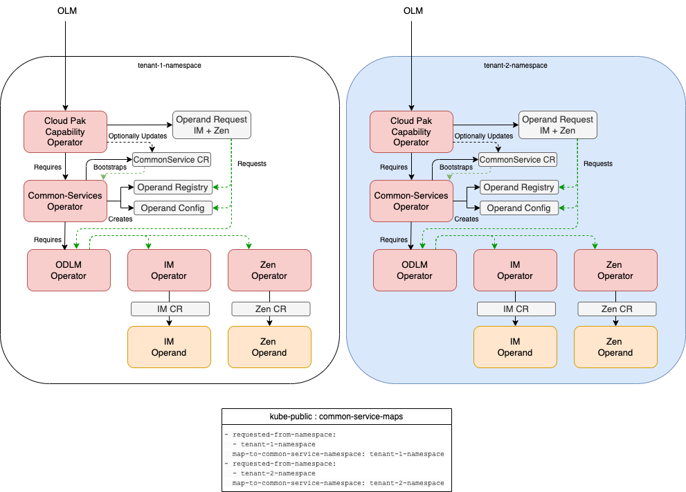
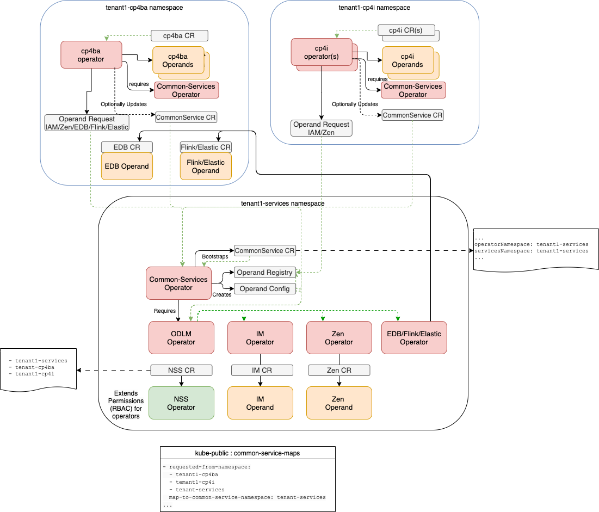
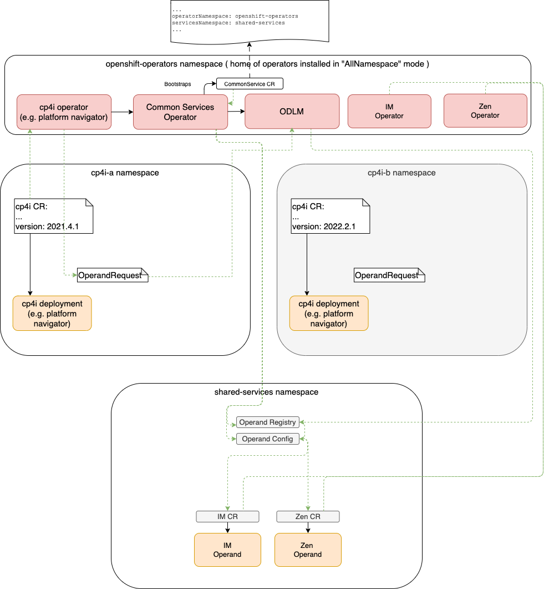

#### Workload isolation topologies.

## This is a DRAFT...

By default, cloud pak operator is installed in 'one namespace' mode with foundational services in the same namespace. 

This topology enables maximum isolation between cloud pak deployments. Each cloud pak deployment can be upgraded independently. 

Another topology is to install foundational services in one namespace and cloud pak operators in another namespace. 
In this case foundational services can be shared by a tenant. Foundational service operators must be given access to tenant namespaces.

Another topology is to place operators in one namespace and create operands in another namespace. 
This approach is taken by Cloud Pak for Data. 

If cloud pak operator is installed in 'all-namespaces' mode, then foundational services operators must be installed in `all namespaces` mode. 
If one cloud pak operator is installed in 'all-namespaces' mode, then all other cloud pak operators must be installed in `all-namespaces` mode. 

It is recommended that cloud paks are installed in isolated namespaces and not share foundational services. 

#### Simple Isolation.

#### Cloud Paks and Namespaces for the Same Tenant with Shared Services

#### All Namespace Mode Installation with Single-Tenancy

### Cloud Pak Cluster Topology Considerations

> IBM recommends, that Cloud Pak namespaces be labeled and assigned to machine sets. Machine set must have 3 or more nodes 
> Private topology is prefred to isolate all services by tenant (namespace). IBM recommends that each cloud pak instance is installed with it's own dedicated foundational services. 
> Cloud Paks can be deployed to Machine Sets (grouping of worker nodes that scale up and down) to provide workload isolation for worker nodes. For clusters with in Cloud Availability Zones, worker nodes should be placed accross all zones. 
