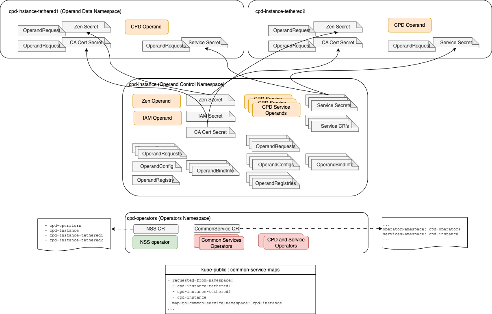

#### Workload isolation topologies.
We present a number of isolation topologies, and discuss the role foundational services play to support workload isolation. 

Each topology will make a choice on the placement of foundational operators, and foundational services (operands), and this choice will enable a variety of workload isolation patterns. 

Examples of foundational services: `im`, `zen`, `Flink`, `Elastic Search`, etc. 

Ask about Foundational Services: 
- What is the namespace for Foundational Services operators? Make a note of *operatorNamespace* value. 
- What is the namespace for Foundational Sevices operands? Make a note of *servicesNamespace* value. 

Ask about Cloud Pak operator:
- What is the namespace for Cloud Pak operator?
- What is the namespace for Cloud Pak operand?

We will discuss mechanics of Foundational Sevices in our next module, but it is important to know that Cloud Pak operator 
requests Foundational Services as needed. 

For example, to request `im` and `zen` foundational sevices, Cloud Pak operator creates *OperandRequest* CR for *ODLM* operator. 

Request created by the Cloud Pak operator must be visible to *ODLM* operator, otherwise nothing will happen. 

*This is key:* 
When acting on Cloud Pak request, *ODLM* operator will place `im` and `zen` operators in *operatorNamespace* 
and their operands (`im` deployment, and `zen` deployment) in *servicesNamespace* 
These namespaces can be the same or different. 

Cloud Pak operators requesting *shared* Foundational Services like `im` or `zen` get the same Foundational Sevice instance. 

Cloud Pak operators requesting Foundational Services like `Flink` that are not shared between Cloud Pak capabilities, 
will trigger `Flink` operator install by *ODLM* and must create `Flink` CR themselves, triggering `Flink` operand deployment. 
`Flink` operator will be installed by *ODLM* in *operatorNamespace* and `Flink` operand will be installed by `Flink` operator 
in Cloud Pak namespace. 

*One Namespace Request Example*.

 

#### Simple Isolation. (A)
By default, Cloud Pak operator is installed in `one namespace` mode with foundational services in the same namespace. 

This topology enables maximum isolation between cloud pak deployments. Each cloud pak deployment can be upgraded independently. 

 

#### Cloud Paks and Namespaces for the Same Tenant with Shared Services. (B)
A `Tenant` is a line of business.  

Install Foundational Services operators and operands in one namespace. 
Foundational Services (`im`, `zen`) will be shared within a `Tenant`. 

Install Cloud Pak operators and operands in other namespaces. 

Because this is single tenant topology, versions and upgrades must be coordinated within the business unit. 

Foundational Services Operators namespace: *operatorNamespace*=`tenant1-services-namespace`. 
Foundational Services Operand namespace: *servicesNamespace*=`tenant1-services-namespace`. 

Cloud Pak for Business Automation namespace: `tenant1-cp4ba` 
Cloud Pak for Integration namespace: `tenant1-cp4i` 

Operators in `tenant1-services` must be able to watch `tenant1-cp4ba` and `tenant1-cp4i` namespaces. 
This authorization is setup by `NamespaceScope operator`. 

The reverse is not true: operators in `tenant1-cp4ba` and `tenant1-cp4i` namespaces are not watching `tenant1-services` namespace. 

Shared services `im` and `zen` are created only once in `tenant1-services` namespace. 

Services for `Flink`, etc are created in Cloud Pak operator namespaces. 

 

#### Install One Cloudpak into 2 namespaces. (C)
Install Foundational Services operators and Cloud Pak operator in one namespace. 
Install Foundational Sevices operands, and Cloud Pak operands in another namespace. 

In this topology, service accounts used by operators are different from service accounts used by operands. 

Operator namespace is called `Control Namespace`, operand namespace is called `Data Namespace`. 

Foundational Services Operators namespace: *operatorNamespace*=`tenant1-control`. 
Foundational Services Operand namespace: *servicesNamespace*=`tenant1-data`. 

Operators in `tenant1-control` namespace are watching `tenant1-data` namespace. 
This authorization is setup by `NamespaceScope` operator. 

Cloud Pak CR is created in `tenant1-data` namespace. 

 

#### All Namespace Mode Installation with Single-Tenancy (D)
In `All Namespace` mode the whole cluster is allocated for one tenant. 

All Cloud Pak operators and all Foundational Services operators will be installed in `all-namespaces` mode. 

Foundational Services Operators namespace: *operatorNamespace*=`openshift-operators`. 
Foundational Services Operand namespace: *servicesNamespace*=`ibm-common-services`. 

Cloud Pak operators are installed in `openshift-operators` namespace. 
Cloud Pak operands are deployed to `cp4i-a` and `cp4i-b` namespace. 

Operators in `openshift-operators` namespace are watching `ibm-common-services` namespace and Cloud Pak operand namespaces. 

 

### Cloud Pak for Data Topologies. (E)
Cloud Pak for data adopts `Operators - Operands - Data` topology. 

This topology is a combination of `Topology B` and `Topology C`. 

Foundational Services Operators and Foundational Services Operands are placed in different namespaces. (Topology *C*). 

Foundational Sevices Operands are shared by Cloud Pak Operands. (Topology *B*). 

Foundational Services Operators namespace: *operatorNamespace*=`cpd-operators`. 
Foundational Services Operand namespace: *servicesNamespace*=`cpd-instance`. 

Operators in `cpd-operators` are watching `cpd-instance` namespace and `cpd-instance-tethered1` and `cpd-instance-tethered2` namespaces. 
Secrets from `cpd-instance` namespace are copied to tehtered namespaces, for access to Common Services. 

 

 

### Cloud Pak Cluster Topology Considerations
IBM recommends, that Cloud Pak namespaces be labeled and assigned to machine sets. Machine set must have 3 or more nodes 

Private topology is prefred to isolate all services by tenant (namespace). 
IBM recommends that each cloud pak instance is installed with it's own dedicated foundational services. 

Cloud Paks can be deployed to Machine Sets (grouping of worker nodes that scale up and down) to provide workload isolation for worker nodes.  
For clusters with in Cloud Availability Zones, worker nodes should be placed accross all zones. 
