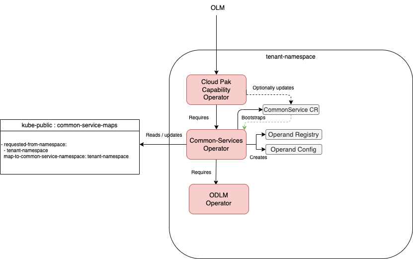
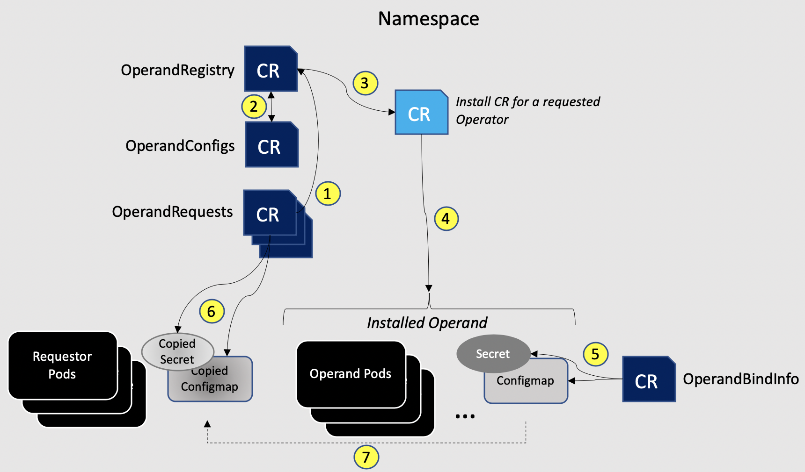

### Foundational Services.

*Cloud Pak for Business Automation* is multi-pattern cloud pak: workflow, content, document automation, process mining, etc.<br/>
Each capability requires *`iam`* and *`zen ui`* components. These are *core* services that provide consistent authentication and UI experience.<br/>

In addition, cloud pak capabilities require databases, event processors, search service, and business teams service.<br/>
If you review `patterns knowledge base`, you will find that all patterns depend on *`cloud pak foundational components`*.<br/>

Other cloud paks (*Cloud Pak for Integration*, *Cloud Pak for Data*, *Cloud Pak for AIOPS*), require *`foundational components`*.<br/>

`Core` foundational services must be deployed with every cloud pak operator deployment.<br/>
`Optional` foundational services are deployed only if they are selected for deployment either directly, or as a dependency by cloud pak capabilities.<br/>

`Core` foundational services:<br/>
```
- iam - Identity and Access Management
- zen UI - Integrated UI, includes identity and role management to control access to installed capabilities.
- licensing - Cloud Pak usage, *singleton*, only one instance of this operator in the cluster.
- certificate management - manage and store tls certificates, *singleton*, only one instance of this operator in the cluster.
- namespace scope - grant operator permissions in advanced topologies.
```

`Optional` foundational services:<br/>
```
- db2
- postgres
- kafka
- flink
- elastic search
- user data services
- business teams service
```

### Foundational Services Operators.

> If we query installed operators before and after we applied cloud pak CR, we find that operator list has more operators.<br/>
```
oc get csv

NAME                                          DISPLAY                                                       VERSION   REPLACES                          PHASE
cloud-native-postgresql.v1.18.5               EDB Postgres for Kubernetes                                   1.18.5    cloud-native-postgresql.v1.18.4   Succeeded
ibm-ads-operator.v23.1.1                      IBM CP4BA Automation Decision Service                         23.1.1                                      Succeeded
ibm-cert-manager-operator.v4.0.0              IBM Cert Manager                                              4.0.0                                       Succeeded
ibm-common-service-operator.v4.0.1            IBM Cloud Pak foundational services                           4.0.1                                       Succeeded
ibm-commonui-operator.v4.0.0                  Ibm Common UI                                                 4.0.0                                       Succeeded
ibm-content-operator.v23.1.1                  IBM CP4BA FileNet Content Manager                             23.1.1                                      Succeeded
ibm-cp4a-operator.v23.1.1                     IBM Cloud Pak for Business Automation (CP4BA) multi-pattern   23.1.1                                      Succeeded
ibm-cp4a-wfps-operator.v23.1.1                IBM CP4BA Workflow Process Service                            23.1.1                                      Succeeded
ibm-dpe-operator.v23.1.1                      IBM Document Processing Engine                                23.1.1                                      Succeeded
ibm-iam-operator.v4.0.1                       IBM IM Operator                                               4.0.1                                       Succeeded
ibm-insights-engine-operator.v23.1.1          IBM CP4BA Insights Engine                                     23.1.1                                      Succeeded
ibm-mongodb-operator.v4.0.0                   IBM MongoDB Operator                                          4.0.0                                       Succeeded
ibm-odm-operator.v23.1.1                      IBM Operational Decision Manager                              23.1.1                                      Succeeded
ibm-pfs-operator.v23.1.1                      IBM CP4BA Process Federation Server                           23.1.1                                      Succeeded
ibm-zen-operator.v5.0.0                       IBM Zen Service                                               5.0.0                                       Succeeded
icp4a-foundation-operator.v23.1.1             IBM CP4BA Foundation                                          23.1.1                                      Succeeded
operand-deployment-lifecycle-manager.v4.0.0   Operand Deployment Lifecycle Manager                          4.0.0                                       Succeeded
```
The reason is that some operator dependencies are resolved dynamically, at run time.<br/>

To support Cloud Pak requirements,`Foundational services operators` enable *runtime dependency resolution*, *versioning*, and *sharing* of `foundational services`.<br/>

#### Foundational sevices bootstrap.

Foundational services link to a cloud pak, `ibm-common-services` operator is a dependency of a cloud pak operator.<br/>
As we discussed earlier, when an operator is installed, dependent operators are always installed.<br/>

In turn, `ibm-common-services` operator depends on another operator, `operand-deployment-lifecycle-manager` operator, *ODLM*.<br/>

> Bootstrap chain: `cloud-pak operator` -> `ibm-common-services-operator` -> `ODLM`.<br/>



An *operator* is acting on it's *operands*. CR is a *trigger*. <br/>
When operator detects CR, it will act on it's *operands* to reconsile state with CR requirements.<br/> 
To say it differently, CR reconciliation results in *operand* deployment.<br/>

Operand examples: *Deployment*, *StatefulSet*, *Pod*, *Operator*.<br/>

For *ODLM*, an operand is another operator. To act, *ODLM* installs it's operand and then creates a CR for it, triggering reconciliation and operand deployment.<br/>

*OperandRequest* is ODLM CR.<br/>
*OperandRequest* CR can trigger a group of *ODLM* operands. ODLM will manage them at the same time.<br/>

> Event chain: *OperandRequest* CR -> *ODLM* -> install new operator(s) and create CR(s) -> trigger operand deployment for new operator(s).<br/>

*ODLM* manages *groups of operands*.<br/>

*ODLM* enables *on-demand depedency resolution*, and *sharing of foundational services*.<br/>

> *This is Key*:<br/>
`ODLM` installs new operators *on demand* and *automatically applies preconfigured CR*, triggering CR reconciliation and new operand deployment.<br/>
For shared foundational services, `ODLM` creates just one instance of a service operator, and one instance of a service.<br/>
In some cases, ODLM will just install it's operand without creating triggering CR.<br/>

#### *ODLM* architecture.<br/>



#### *ODLM* on-demand dependecy resolution.

We review *ODLM* configuration CRs, and explain runtime dependency resolution.<br/>

To start, when cloud pak operator needs foundational services it creates *OperandRequest* CR with required services.<br/>

> Lab step<br/>
View *OperandRequests* created by CP4BA operator.<br/>

```
oc get OperandRequests

NAME                             AGE    PHASE     CREATED AT
cloud-native-postgresql-opreq    4d8h   Running   2023-09-25T18:29:47Z
iaf-system-common-service        4d8h   Running   2023-09-25T18:25:18Z
ibm-iam-request                  4d8h   Running   2023-09-25T18:26:28Z
ibm-iam-service                  4d8h   Running   2023-09-25T18:29:49Z
ibm-wps-postgre-operandrequest   4d7h   Running   2023-09-25T19:09:23Z
zen-ca-operand-request           4d8h   Running   2023-09-25T18:30:36Z
```

> Lab step
View `iaf-system-common-service` OperandRequest<br/>
```
oc get operandrequests iaf-system-common-service -o yaml | yq -y '.spec'

requests:
  - operands:
      - name: ibm-platformui-operator
      - name: ibm-im-operator
    registry: common-service
    registryNamespace: cp4ba
```

2 operands are requested: `ibm-platformui-operator`, and `ibm-im-operator`.<br/>
There is also a reference to *registry* and *registry namespace*.<br/>

*Registry* refers to *OperandRegistry* CR.<br/>
*OperandRegistry* is a list of operator subscription metadata for all foundational services operators.<br/>
*ODLM* will search *OperandRegstry* CR `common-service` for the names of operands.<br/>

> Lab step.<br/>
How many subscriptions in OperandRegistry common-registry?<br/>
```
oc get operandregistry common-service -o yaml | yq '.spec.operators[].name' | wc -l
27
```

List all subscription names in OperandRegistry common-registry.<br/>
```
oc get operandregistry common-service -o yaml | yq '.spec.operators[].name'
```

> Lab step.<br/>
Query *OperandRegisty* common-service CR for *ibm-platformui-operator* subscription.<br/>

```
oc get OperandRegistry common-service -o yaml | yq -y '.spec.operators[] | select(.name == "ibm-platformui-operator")'

channel: v4.0
installPlanApproval: Automatic
name: ibm-platformui-operator
namespace: cp4ba1
packageName: ibm-zen-operator
scope: public
sourceName: opencloud-operators-v4-0
sourceNamespace: openshift-marketplace
```

> Lab step<br/>
Query *OperandRegistry* common-service CR for ibm-im-operator.<br/>

```
oc get OperandRegistry common-service -o yaml | yq -y '.spec.operators[] | select(.name == "ibm-im-operator")'

channel: v4.0
installPlanApproval: Automatic
name: ibm-im-operator
namespace: cp4ba1
packageName: ibm-iam-operator
scope: public
sourceName: opencloud-operators-v4-0
sourceNamespace: openshift-marketplace
```

*ODLM* will use this information to create subscriptions for requested *Foundational Services* operators.<br/>

Note that *namespace* key is operator subscription namespace. We could have changed the value of the *namespace* key to some other namespace.<br/>
This is key to *multi-tenancy* deployments and *workload isolation*. This is how we control operator placement for Foundational Services.<br/>

We now know how *ODLM* creates operator subscriptions to install FoundationalServices operators.<br/>
But how to create CR's for these new operators?<br/>

To find information about how to create CR's, *ODLM* will query *OperandConfig* CR.<br/>

> Lab step.<br/>
List OperandConfig CR.<br/>
```
oc get OperandConfig

NAME             AGE    PHASE     CREATED AT
common-service   2d6h   Running   2023-10-11T19:20:26Z
```

*OperandConfig* common-service CR contains information needed to build CR.<br/>

Query *OperandConfig* common-service CR for ibm-im-operator CR.<br/>

```
oc get OperandConfig common-service -o yaml | yq -y '.spec.services[] | select(.name == "ibm-im-operator")'
```

> Lab Step.<br/>
Query OperandConfig common-service for ibm-platformui-operator.<br/>

```
oc get OperandConfig common-service -o yaml | yq -y '.spec.services[] | select(.name == "ibm-platformui-operator")'
```

With information about foundational service operator subscription and about foundational service operator CR,<br/> 
ODLM will create operator subscriptions, and then create CR to trigger operand deployment reconciliation.<br/>

Operator and Operand are deployed on-demand.<br/>

> Lab step.<br/>
Validate ibm-im-operator, and ibm-platformui-operator subscriptions.<br/>

```
oc get subscriptions | grep -E "ibm-im-operator|ibm-platformui-operator" 
NAME                                                                                 PACKAGE                        SOURCE                            CHANNEL
ibm-im-operator                                                                      ibm-iam-operator               opencloud-operators-v4-0          v4.0
ibm-platformui-operator                                                              ibm-zen-operator               opencloud-operators-v4-0          v4.0 
```

To see what *Foundational Service* operators are installed and why, query *status* field of the *OperandRegistry*.<br/>
In the output, operator name key is followed by OperandRequests.<br/>

> Lab step.<br/>
Query OperandRegistry common-service for foundational services operator status.<br/>

```
oc get operandregistry common-service -o yaml | yq -y '.status'

operatorsStatus:
  cloud-native-postgresql:
    reconcileRequests:
      - name: cloud-native-postgresql-opreq
        namespace: cp4ba1
      - name: ibm-wps-postgre-operandrequest
        namespace: cp4ba1
  ibm-idp-config-ui-operator:
    reconcileRequests:
      - name: ibm-iam-request
        namespace: cp4ba1
  ibm-im-mongodb-operator:
    reconcileRequests:
      - name: ibm-iam-request
        namespace: cp4ba1
  ibm-im-operator:
    reconcileRequests:
      - name: ibm-iam-service
        namespace: cp4ba1
      - name: iaf-system-common-service
        namespace: cp4ba1
  ibm-platformui-operator:
    reconcileRequests:
      - name: zen-ca-operand-request
        namespace: cp4ba1
      - name: iaf-system-common-service
        namespace: cp4ba1
phase: Running
```

We validated basic workings of *ODLM*, and how it creates on-demand operator subscriptions, and CR's to trigger operand deployment.<br/>

> Event chain: *OperandRequest* CR -> *ODLM*, (search *OperandRegistry*, *OperandConfig*) -> operator subscription, CR -> operand deployment<br/>

#### IBM Common Services Operator

There is one more important operator supporting foundational services. It is `ibm-common-services` operator.<br/>
As mentioned before, this is a link between *Foundational Services* and *Cloud Pak* operator.<br/>

`ibm-foundational-services` operator creates *CommonService* CR *common-service* that plays important role in foundational services configuration and multi-tenancy.<br/>

```
oc get CommonService

NAME             AGE
common-service   2d8h
```

If you need to configure foundational services, you will be working with *CommonService common-service* CR.<br/>

```
oc get CommonService common-service -o yaml | yq -y '.spec'

license:
  accept: true
operatorNamespace: cp4ba1 <= namespace for Foundational Services operators
servicesNamespace: cp4ba1 <= namespace for Foundational Services (operands)
size: starterset
storageClass: ocs-storagecluster-ceph-rbd
```

By using parameters in this CR we can affect placement of Foundational Services operators, and Foundational Services namespaces.<br/>
This is how we achieve mutli tenancy and workload isolation for Cloud Pak deployments.<br/>

We review mutli-tenancy and workload isolation in another module.<br/>
